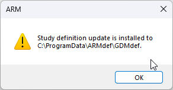

# Standard ARM Sumitomo reports

## Full Documentation

See the [Wiki](https://github.com/Sumitomo-Chemical-Agro-Europe/ARM-Reports/wiki) for full documentation, examples, operational details and other information.

## How to install ARM files for standard ARM Sumitomo reports?

### 1)	Download the required files: 
Please download the required files here : [GDMdef.a7z](https://github.com/Sumitomo-Chemical-Agro-Europe/ARM-Reports/blob/main/GDMdef.a7z)

### 2)	Open the file with ARM :

Wait for the confirmation message :

If you have any troubles with this process, please get in touch with SCAE Data management team : asde-datamanagement@sumitomo-chemical.eu

## Set up the format date in ARM

To do once (the first time you use the set)

 

